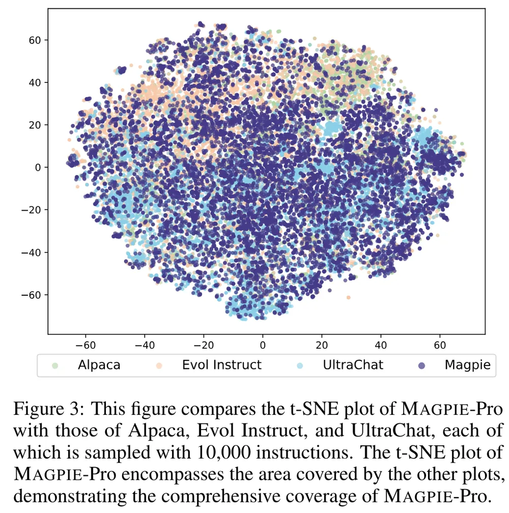

# 2024년 인공지능의 한국어 능력 평가 경진 대회 개최 - 대화맥락추론(나)

  이번 대화맥락추론-(나)에 참가하여 리더보드 2위를 달성한 타마고 팀입니다.

## 1. 데이터셋
현재 국립국어원에서는 train, dev, test 형식으로 데이터셋을 제공해주고 있습니다. (나) 유형은 데이터 증강이 가능하여, 우리는 국립국어원에서 제공한 데이터셋 외에 총 3개의 데이터셋을  추가하였습니다.
* [모두의 말뭉치-대화맥락추론2023](https://kli.korean.go.kr/corpus/main/requestMain.do#)
* [한국어 첨삭 데이터셋](자체적으로 수집하고 가공한 데이터셋)
* [Gemma-Magpie](https://huggingface.co/datasets/nayohan/Magpie-Gemma2-Pro-200K-Filtered-ko)

### 1-1. 데이터셋 선정 목적
- 현재 국립국어원에서는 학습과 검증용으로, 909개를 제공하는데, 해당 데이터셋을 통해서 대회의 목표인 대화의 문맥을 이해하는 능력과 적합한 추론을 선택하는데 부족하다고 판단했습니다.
- 그래서 우리는 대화맥락추론에서 중요한 대화의 문맥을 이해하기 위해, 첨삭 데이터셋을 추가하였습니다. 첨삭 데이터를 추가해줌으로써, 대화문의 중의적인 표현에서 문장이 중요한 부분을 더 잘 이해할 수 있도록 간접적으로 기여하였습니다.
- 두 번째로, [Magpie](https://github.com/magpie-align/magpie) 방법론을 활용하였습니다. Magpie는 LLM 모델에서 합성 데이터를 생성해주는 방법인데, LLM의 자기회귀적 성질을 활용하여 사전 템플릿만을 주어 다양한 분야의 도메인 데이터를 생성합니다.
  이렇게 수집한 데이터는 SFT+DPO보다 더 높은 성능을 발휘하고 이를 현재 학습된 언어모델에 적용하여, 특정 Task 위주로 학습하면 발생되는 Logit 분포의 불균형을 해소하였고, 언어 모델의 망각현상을 줄이는데 기여하였습니다.

  

### 1-2. 데이터 전처리
