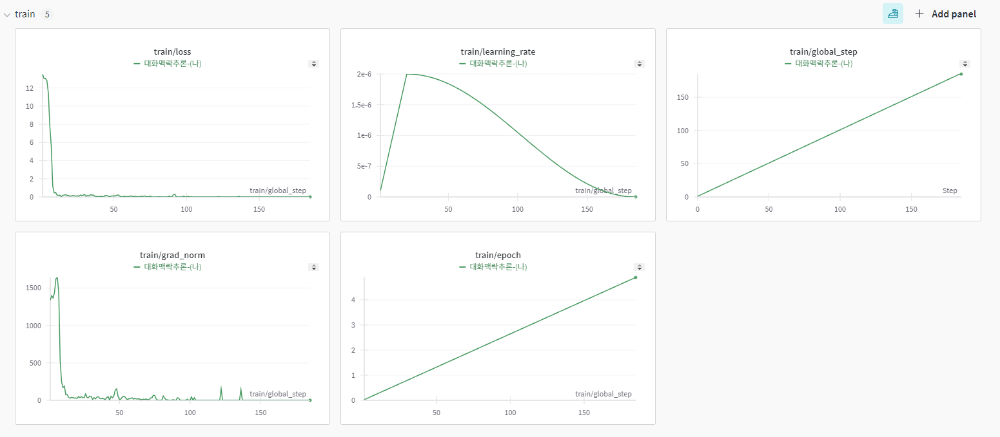
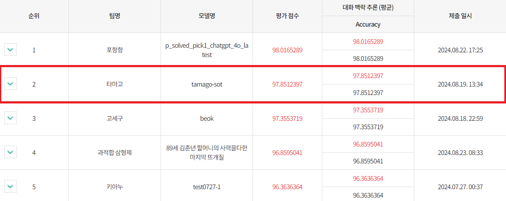
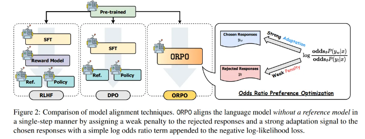

# 2024년 인공지능 한국어 능력 평가 경진 대회 - 대화맥락추론(나)
<div align='left'>
  이번 대화맥락추론-(나)에 참가하여 리더보드 2위를 달성한 타마고 팀입니다.🎇
</div>

## 1. 데이터셋
현재 국립국어원에서는 train, dev, test 형식으로 데이터셋을 제공해주고 있습니다. (나) 유형은 데이터 증강이 가능하여, 우리는 국립국어원에서 제공한 데이터셋 외에 총 3개의 데이터셋을  추가하였습니다.
* [모두의 말뭉치-대화맥락추론2023](https://kli.korean.go.kr/corpus/main/requestMain.do#)
* 한국어 첨삭 데이터셋(자체적으로 수집하고 가공한 데이터셋)
* [Gemma-Magpie](https://huggingface.co/datasets/nayohan/Magpie-Gemma2-Pro-200K-Filtered-ko)

### 1-1. 데이터셋 선정 목적
- 현재 국립국어원에서는 학습과 검증용으로, 909개를 제공하는데, 해당 데이터셋을 통해서 대회의 목표인 대화의 문맥을 이해하는 능력과 적합한 추론을 선택하는데 부족하다고 판단했습니다.
- 그래서 우리는 대화맥락추론에서 중요한 대화의 문맥을 이해하기 위해, 첨삭 데이터셋을 추가하였습니다. 첨삭 데이터를 추가해줌으로써, 대화문의 중의적인 표현에서 문장이 중요한 부분을 더 잘 이해할 수 있도록 간접적으로 기여하였습니다.
- 두 번째로, [Magpie](https://github.com/magpie-align/magpie) 방법론을 활용하였습니다. Magpie는 LLM 모델에서 합성 데이터를 생성해주는 방법인데, LLM의 자기회귀적 성질을 활용하여 사전 템플릿만을 주어 다양한 분야의 도메인 데이터를 생성합니다.
  이렇게 수집한 데이터는 SFT+DPO보다 더 높은 성능을 발휘하고 이를 현재 학습된 언어모델에 적용하여, 특정 Task 위주로 학습하면 발생되는 Logit 분포의 불균형을 해소하였고, 언어 모델의 망각현상을 줄이는데 기여하였습니다.

<div align='center'>
  
</div>

### 1-2. 데이터 전처리
- 전처리는 크게 4가지 방법을 사용하였습니다.
  1. 대화문에서 특수문자와 불용어가 존재하였는데, 이를 필터링하여 제거하였습니다.
  2. 공개적으로 수집한 데이터셋에서 중복을 제거하기 위해 [Simhash](https://github.com/1e0ng/simhash) 을 활용하였습니다.
  3. 미세조정을 수행하기 위해 대화 모델에 맞는 chat_template을 alpaca 형식으로 전처리를 수행하였습니다.
  4. 마지막으로, 모두의 말뭉치와 첨삭 데이터셋에서 [Knowledge Distilization](https://arxiv.org/pdf/2306.08543)을 활용하여 Sota 모델에서 나온 지식을 소형 모델에 지식을 증류하는 방식으로 데이터 증강을 수행하였습니다.

 ## 2. 모델 선택 개요
 이번 대화 맥락 추론에서 사용된 모델의 종류는 5가지 입니다.
 - [MLP-KTLim/llama-3-Korean-Bllossom-8B](https://huggingface.co/MLP-KTLim/llama-3-Korean-Bllossom-8B)
 - [cpm-ai/Ocelot-Ko-self-instruction-10.8B-v1.0](https://huggingface.co/cpm-ai/Ocelot-Ko-self-instruction-10.8B-v1.0)
 - [THUDM/glm-4-9b-chat](https://huggingface.co/THUDM/glm-4-9b-chat)
 - [Qwen/Qwen2-7B-Instruct](Qwen/Qwen2-7B-Instruct)
 - [google/gemma-2-9b-it](https://huggingface.co/google/gemma-2-9b-it)

   이 중에서 우리는 최첨단 언어 모델인 Gemma2를 채택하였습니다

   ### 2-1. 모델 선택 이유
   - 현재 Gemma2의 경우, 슬라이딩 윈도우 어텐션을 도입하였는데, 이를 통해 계산 비용을 줄이고, 긴 문장을 처리하는데 용이함. 그래서 일상대화와 같이 긴 대화문에 유용하다고 판단하여 모델을 채택하였습니다.
   - 그리고 Gemma2는  Logit Soft Capping을 사용하였는데, 이를 통해 로짓값의 분포를 고르게하여, 안정적인 미세조정을 수행할 수 있어 최종적으로 Gemma2를 채택하게 되었습니다.
  
## 3. 모델링
우리는 [Axolotl](https://github.com/axolotl-ai-cloud/axolotl)을 사용하여 SFT을 수행하였습니다.

### 3.1 모델 학습 전략
- 학습은 총 2번을 거쳐 진행을 하였습니다. 처음은 QLoRA를 통해 일반적인 지식과 한국어 첨삭능력을 학습을 하여 대화 문맥을 이해하는 능력을, 두 번째로 Full-Tuning을 통해 대화맥락추론에서 적합한 추론을 할 수 있도록 학습하였습니다.
- Full-Tuning을 돌린 이유는 [LIMA](https://arxiv.org/pdf/2305.11206) 논문을 참고하여, 50,000건의 alpaca 데이터로 파인튜닝한 결과보다, 1,000건의 양질의 데이터셋으로 Full-Tuning을 하였을 때, 더 우수한 성능을 발휘하여 이번에 Full-Tuning을 진행하였고, 리더보드 결과 95점 -> 97점으로 높은 성능 향상을 이뤄낼 수 있었습니다.

<details>
<summary>HyperParameter</summary>
  
- 'QLORA' 
  - `lora_r`: 16
  - `lora_alpha`: 32
  - `lora_dropout`: 0.05
  - 'lora_target_linear': true
  - 'load_in_4bit': true
  - `torch_dtype`: bfloat16
  - `seed`: 42
  - `epoch`: 5
  - `micro_batch_size`: 4
  - `weight_decay`: 0.05
  - 'weight_ratio' : 0.1
  - `lr_scheduler_type`: "cosine"
  - `warmup_steps`: 20
  - 'learning_rate': 2e-5
  - 'optimizer' : 'adamw_bnb_8bit'
  - `gradient_accumulation_steps`: 4
  - `gradient_checkpointing`: True
  - `max_seq_length`: 1024

- 'Full-Tuning'
  - `torch_dtype`: bfloat16
  - `seed`: 42
  - `epoch`: 5
  - `micro_batch_size`: 3
  - `weight_decay`: 0.05
  - `lr_scheduler`: "cosine"
  - `warmup_steps`: 20
  - 'learning_rate': 2e-5
  - 'optimizer' : 'adamw_bnb_8bit'
  - `gradient_accumulation_steps`: 5
  - `gradient_checkpointing`: True
  - `max_seq_length`: 1024
  - 'sample_packing' : true
  - 'pad_to_sequence_len' : true
</details>

## 4. 학습 및 평가결과
<div align='center'>
  
</div>
<div align='center'>
  
</div>

- 학습 결과 Loss값은 13으로 시작하여 점점 0으로 수렴하여 성공적으로 학습을 하였습니다.
- 평가 결과로, 두 단계를 거쳐 학습을 진행하여 97.85점으로 높은 점수를 받을 수 있었습니다.

## 5. 모델 사용 방법
```python
import torch
from transformers import AutoTokenizer, AutoModelForCausalLM, TextStreamer

BASE_MODEL = "cpm-ai/gemma2-maerak-sota"
model = AutoModelForCausalLM.from_pretrained(BASE_MODEL,torch_dtype=torch.float16, device_map={"":0},)
tokenizer = AutoTokenizer.from_pretrained(BASE_MODEL)
streamer = TextStreamer(tokenizer)


chat = [
    { "role": "user", "content": """[Conversation]
화자1: 복수전공이면 엄청 힘들었을 것 같은데요
화자2: 엄마 집에 있으니까 단점이 있어요
화자1: 어떤 단점이지요
화자2: 화장실 이용
화자1: 계속 말 것이나요
화자2: 엄마가 맨날 거실에 계시는데
화자1: 아 겹치나요
화자2: 거실에 화장실이 있거든요
화자2: 큰 볼일을 못 보겠어요
화자1: 아 이럴 수가
화자2: 제가 화장실을 가리거든요
화자1: 음악을 크게 틀어 놓는 건 어떤가요
화자1: 배 아프면 일상 생활이 잘 안 되잖아요
화자2: 그게 더 티나잖아요
화자1: 그렇다면 차라리 방귀 뀌는음을 다운 받아서 틀어 놓고 편하게 사세요
화자2: 음파가 다르답니다 뚫고나와요
화자2: 그래서 제가 아침 일찍
화자1: 누가 방귀 뀌는 g 똥 싸는지 모르게 한번 틀어 놓고 싸 보세요
화자2: 카페로 옵니다
화자2: 화장실이 세 칸 있어요
화자1: 카페 등 편한 가요
화자1: 화장실에 사람 많이 없네요
화자2: 여기서 편하게 봐요
화자2: 아침엔 카페에 사람이 없어요

[Question]
위 대화의 원인으로 올바른 지문은?

[Option]
A. 화자2의 자취 집에 있는 거실 화장실은 방음이 잘 안된다.
B. 화자2의 어머님 집 거실에 있는 화장실은 방음이 잘 안된다.
C. 화자2의 어머님 집 거실에 있는 화장실은 방음이 잘된다.""" },
]

prompt = tokenizer.apply_chat_template(chat, tokenize=False, add_generation_prompt=True)
inputs = tokenizer.encode(prompt, add_special_tokens=False, return_tensors="pt")
outputs = model.generate(input_ids=inputs.to(model.device), 
                         max_new_tokens=1024,
                         do_sample=False,
                         streamer=streamer
                        )
```
<div align='center'>
  
</div>

## 6. 추후 연구 계획
- 추후 연구 계획으로, 최근 강화학습 방식으로 Orpo Tuning을 진행 할 예정입니다.
- 기존에는 SFT + DPO로 모델들의 연구들이 주로 진행이 되는데, Orpo는 SFT 과정없이 DPO와 같이 선호/비선호도 데이터셋으로 구성이 되어, 선호도 데이터에는 DPO처럼 우선순위를 부여하지만, 비선호 데이터셋에서는 로그 우도 함수를 통해 패널티를 부여하여, 대화맥락을 추론 할 때, 좀 더 높은 성능과 함께 계산에 사용되는 시간과 리소스를 줄여서 추후에 진행 할 예정입니다.
