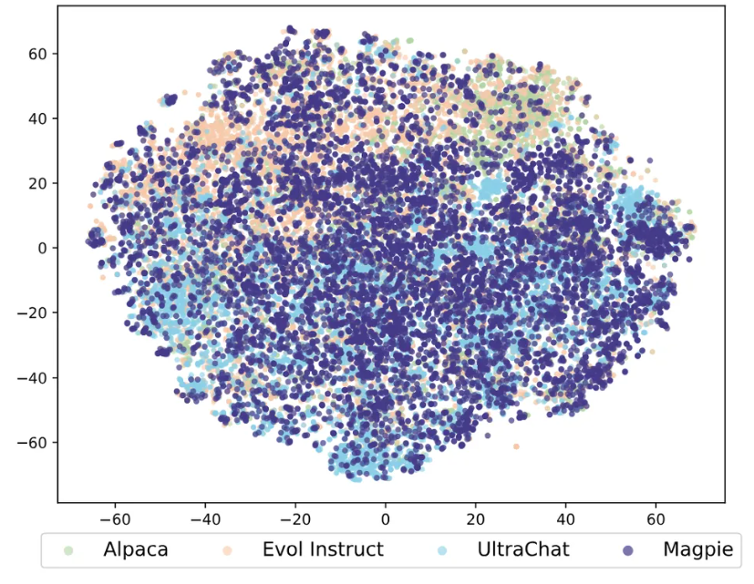

# 2024년 인공지능의 한국어 능력 평가 경진 대회 개최 - 대화맥락추론(나)

  이번 대화맥락추론-(나)에 참가하여 리더보드 2위를 달성한 타마고 팀입니다.

## 1. 데이터셋
현재 국립국어원에서는 train, dev, test 형식으로 데이터셋을 제공해주고 있습니다. (나) 유형은 데이터 증강이 가능하여, 우리는 국립국어원에서 제공한 데이터셋 외에 총 3개의 데이터셋을  추가하였습니다.
* [모두의 말뭉치-대화맥락추론2023](https://kli.korean.go.kr/corpus/main/requestMain.do#)
* [한국어 첨삭 데이터셋](자체적으로 수집하고 가공한 데이터셋)
* [Gemma-Magpie](https://huggingface.co/datasets/nayohan/Magpie-Gemma2-Pro-200K-Filtered-ko)

### 1-1. 데이터셋 선정 목적
- 현재 국립국어원에서는 학습과 검증용으로, 909개를 제공하는데, 해당 데이터셋을 통해서 대회의 목표인 대화의 문맥을 이해하는 능력과 적합한 추론을 선택하는데 부족하다고 판단했습니다.
- 그래서 우리는 대화맥락추론에서 중요한 대화의 문맥을 이해하기 위해, 첨삭 데이터셋을 추가하였습니다. 첨삭 데이터를 추가해줌으로써, 대화문의 중의적인 표현에서 문장이 중요한 부분을 더 잘 이해할 수 있도록 간접적으로 기여하였습니다.
- 두 번째로, [Magpie](https://github.com/magpie-align/magpie) 방법론을 활용하였습니다. Magpie는 LLM 모델에서 합성 데이터를 생성해주는 방법인데, LLM의 자기회귀적 성질을 활용하여 사전 템플릿만을 주어 다양한 분야의 도메인 데이터를 생성합니다.
  이렇게 수집한 데이터는 SFT+DPO보다 더 높은 성능을 발휘하고 이를 현재 학습된 언어모델에 적용하여, 특정 Task 위주로 학습하면 발생되는 Logit 분포의 불균형을 해소하였고, 언어 모델의 망각현상을 줄이는데 기여하였습니다.

  

### 1-2. 데이터 전처리
- 전처리는 크게 4가지 방법을 사용하였습니다.
  1. 대화문에서 특수문자와 불용어가 존재하였는데, 이를 필터링하여 제거하였습니다.
  2. 공개적으로 수집한 데이터셋에서 중복을 제거하기 위해 [Simhash](https://github.com/1e0ng/simhash) 을 활용하였습니다.
  3. 미세조정을 수행하기 위해 대화 모델에 맞는 chat_template을 alpaca 형식으로 전처리를 수행하였습니다.
  4. 마지막으로, 모두의 말뭉치와 첨삭 데이터셋에서 [Knowledge Distilization](https://arxiv.org/pdf/2306.08543)을 활용하여 Sota 모델에서 나온 지식을 소형 모델에 지식을 증류하는 방식으로 데이터 증강을 수행하였습니다.

 ## 2. 모델 선택 개요
 이번 대화 맥락 추론에서 사용된 모델의 종류는 5가지 입니다.
 - [MLP-KTLim/llama-3-Korean-Bllossom-8B](https://huggingface.co/MLP-KTLim/llama-3-Korean-Bllossom-8B)
 - [cpm-ai/Ocelot-Ko-self-instruction-10.8B-v1.0](https://huggingface.co/cpm-ai/Ocelot-Ko-self-instruction-10.8B-v1.0)
 - [THUDM/glm-4-9b-chat](https://huggingface.co/THUDM/glm-4-9b-chat)
 - [Qwen/Qwen2-7B-Instruct](Qwen/Qwen2-7B-Instruct)
 - [google/gemma-2-9b-it](https://huggingface.co/google/gemma-2-9b-it)

   이 중에서 우리는 최첨단 언어 모델인 Gemma2를 채택하였습니다

   ### 2-1. 모델 선택 이유
   - 현재 Gemma2의 경우, 슬라이딩 윈도우 어텐션을 도입하였는데, 이를 통해 계산 비용을 줄이고, 긴 문장을 처리하는데 용이함. 그래서 일상대화와 같이 긴 대화문에 유용하다고 판단하여 모델을 채택하였습니다.
   - 그리고 Gemma2는  Logit Soft Capping을 사용하였는데, 이를 통해 로짓값의 분포를 고르게하여, 안정적인 미세조정을 수행할 수 있어 최종적으로 Gemma2를 채택하게 되었습니다.
  
   ## 3. 모델링
